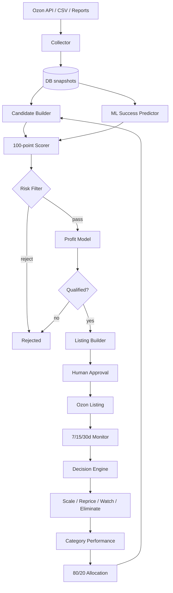

# Architecture

```mermaid
flowchart TD
  A[Ozon API / CSV / Reports] --> B[Collector]
  B --> C[(DB snapshots)]
  C --> D[Candidate Builder]
  D --> E[100-point Scorer]
  E --> F{Risk Filter}
  F -- reject --> X[Rejected]
  F -- pass --> G[Profit Model]
  G --> H{Qualified?}
  H -- no --> X
  H -- yes --> I[Listing Builder]
  I --> J[Human Approval]
  J --> K[Ozon Listing]
  K --> L[7/15/30d Monitor]
  L --> M[Decision Engine]
  M --> N[Scale / Reprice / Watch / Eliminate]
  N --> O[Category Performance]
  O --> P[80/20 Allocation]
  P --> D
  C --> Q[ML Success Predictor]
  Q --> E
```
